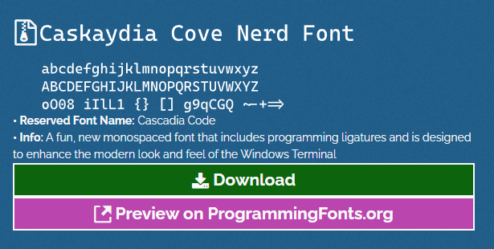

# 목차

### 1. [파워쉘 설치하기](#1-파워쉘-설치하기)

### 2. [파워쉘 꾸미기](#3-파워쉘-꾸미기)

### 3. [파워쉘 $PROFILE(설정파일) 세팅하기](#2-파워쉘-profile설정파일-세팅하기)

## 1. 파워쉘 설치하기

1. 윈도우 버튼을 눌러 cmd를 검색한다.
2. 관리자권한으로 실행하기를 눌러 명령 프롬프트창을 실행한다.
3. 아래 명령어를 CMD에 아래 명령어로 파워쉘을 설치합니다.

   ``` cmd
   # winget module 관리시스템을 사용해 powershell을 설치하는 명령어입니다.
   winget search Microsoft.PowerShell
   ```
4. 설치가 완료되었다면, 윈도우 버튼을 클릭해 `Windows PowerShell`을 검색해 관리자로 실행시켜줍니다.
5. 관리자 권한으로 powershell이 실행되었다면, 아래 명령어를 통해 `$PROFILE`을 설정할 준비를 마칩니다.
   ``` powershell
   # 현재 접속한 사용자(나)에 대해 파워쉘 설정 명령어 실행 권한을 부여하는 명령어입니다.
   Set-ExecutionPolicy -ExecutionPolicy RemoteSigned -Scope CurrentUser
   ```
6. 권한 설정이 완료되었다면, powershell이 실행될 때 첫번째로 참고하는 소위 `init` file을 설정해줄 차례입니다.
   ``` powershell
   # 먼저 documents 폴더로 이동해줍니다.
   cd ~/Documents
   # Powershell을 위한 profile 기본 설정 폴더를 생성해줍니다.
   mkdir 'Windows PowerShell'
   # 폴더 생성이 완료되었다면, powershell을 위한 default profile.ps file을 생성해줍니다.
   New-Item '.\Windows PowerShell\Microsoft.PowerShell_profile.ps1'
   
---

## 2. 파워쉘 꾸미기

1. 폰트 설정
   - NerdFont download - 터미널 아이콘 unicode를 지원하는 폰트 형식입니다.
   - [홈페이지](https://www.nerdfonts.com/font-downloads)
   - 다운로드 클릭
   - 
   - powershell에서 `ctrl + shift + ,` 를 입력해 json 파일로 이동해, font 설정

2. oh-my-posh 다운로드
   - PowerShell 테마 제공
   - [홈페이지](https://ohmyposh.dev/docs/installation/windows)
   - 혹은 PowerShell 오픈

   ``` powershell
   winget install JanDeDobbeleer.OhMyPosh -s winget
   ```

   - 또는

   ``` powershell
   scoop install https://github.com/JanDeDobbeleer/oh-my-posh/releases/latest/download/oh-my-posh.json
   ```

---

## 3. 파워쉘 $PROFILE(설정파일) 세팅하기

### [$PROFILE 설정 설명서](./docs/config_profile.md)

- [PROFILE 예시](Microsoft.PowerShell_profile.ps1)

### [PS json setting 예시](settings.json)

- power shell 에서 `ctrl + shift + ,` 를 입력하면 나타나는 json 형식의 파워쉘 설정 파일이다.

---

### git-posh란?


- 저 위 아기자기한 main branch를 띄워주는,, 즉 현재 내 git branch위치가 어디인지 알려주는 module

- 설치.. 해야겠지? -> 약(10분소요)

## [git-posh 모듈 설치하기](./docs/posh-git.md)

---

### terminal-icons란?


- 저 위 아기자기한 icon들이 보이는가?
- 뭐하나 설치안하고.. -> 약(2분소요)

## [terminal-icons 모듈 설치하기](./docs/terminal-icons.md)

---

### gh이란?

- 내 컴퓨터 내 모든 directory에서 gh 커멘드로 등록해둔 정보에 손쉽게 다가갈 수 있는
- 한번 맛보면 빠져나가기 힘든 그런 친구

## [gh 설치하기](./docs/gh.md)

# HAPPY HACKING :)
